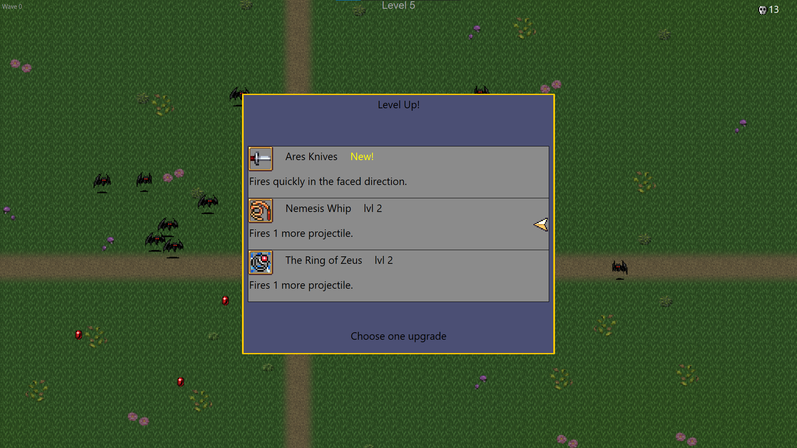

# Hades-Survivors
The game inspired by Vampire Survivors.
# Controls
Walk : __*W A S D*__
# Gameplay
In Hades Survivors, waves of enemies aim to kill you, and your objective is to _survive_. Defeat enemies to earn XP and level up. Each level grants a choice between active and passive upgrades. Active upgrades (Weapons) have cooldowns and are used to kill enemies, while passive upgrades permanently enhance your stats. Strategically select upgrades to strengthen your chances of survival against the relentless enemy waves.
# Screenshots

# How to install?
Download <a href="https://github.com/rycbaryana/Hades-Survivors/releases/tag/v0.1-alpha">exe</a> file and run.

# Contributing
<a href = "https://github.com/rycbaryana">Author</a></h6>
